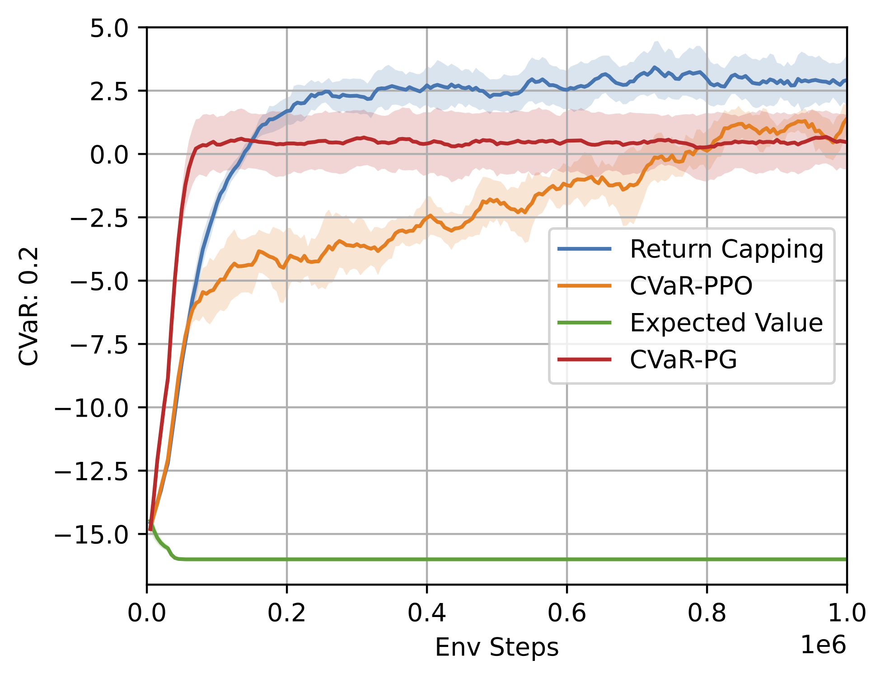
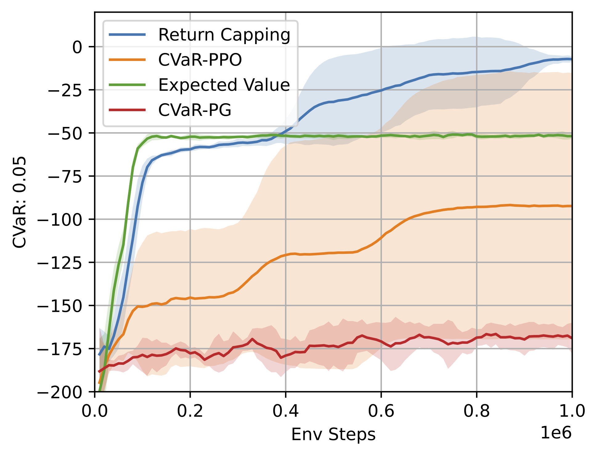
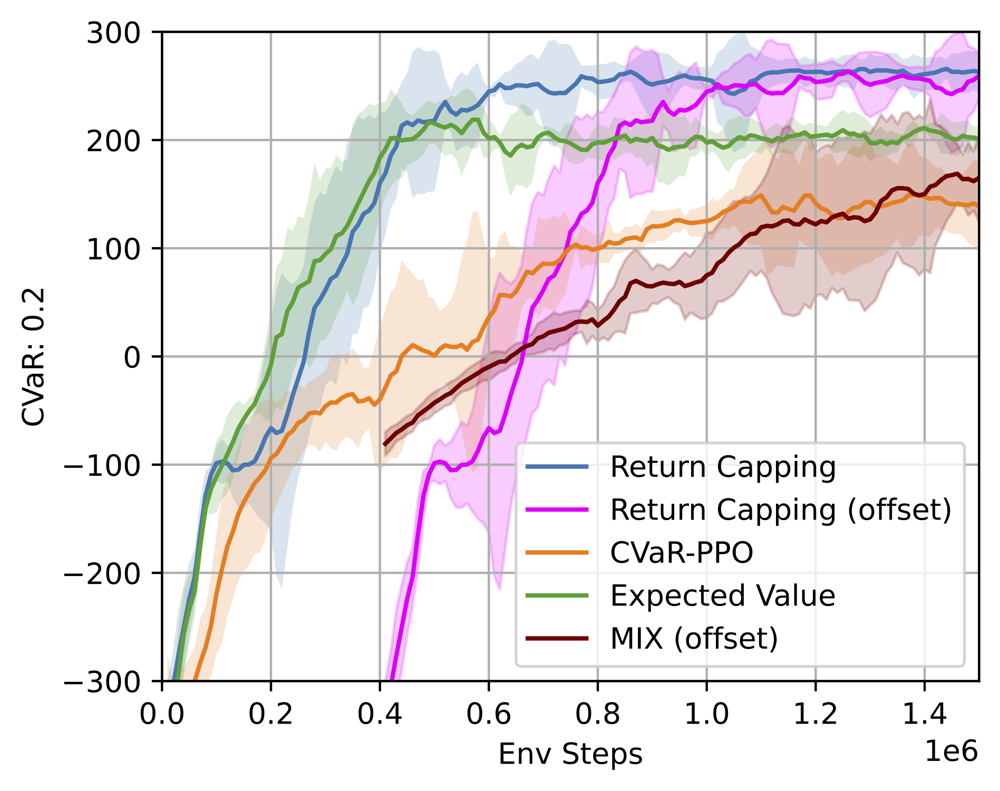

# Return Capping: Sample Efficient CVaR Policy Gradient Optimisation

Return Capping represents a novel method of improving the sample efficiency for training CVaR optimal policies, which we have shown empirically to outperform existing baselines in a number of environments.

<p align="center">
  
  
  
</p>

## Installation

The easiest method to install and setup the run experiments is to use docker. The docker image can be built using 

```bash
make build
```

and the container can be run using

```bash
make run
```

## Running Experiments
There are five available environments
  - betting_game
  - autonomous_vehicle
  - guarded_maze
  - guarded_maze_cesor
  - lunar_lander

An example of how to run code 

```bash
python main.py env=betting_game
```

For Standared PPO CVaR, use the policy.alpha_batch flag to set the CVaR alpha value

```bash
python main.py env=betting_game policy.alpha_batch=0.2
```

For Return Capping, use the cap_return, cap_alpha and cap_tau tags. The latter two flags set the CVaR alpha and the Cap Step size respectively 

```bash
python main.py env=betting_game cap_return=True cap_alpha=0.2 cap_tau=0.1
```

To set minimum cap value, use the initial_return_cap and minimum_return_cap flags

```bash
python main.py env=betting_game cap_return=True cap_alpha=0.2 cap_tau=0.1 initial_return_cap=-0.1 minimum_return_cap=-0.1
```
*Note that the minimum return cap set with this flag is the cap for the normalised return, as we have employed reward normalisation.*
